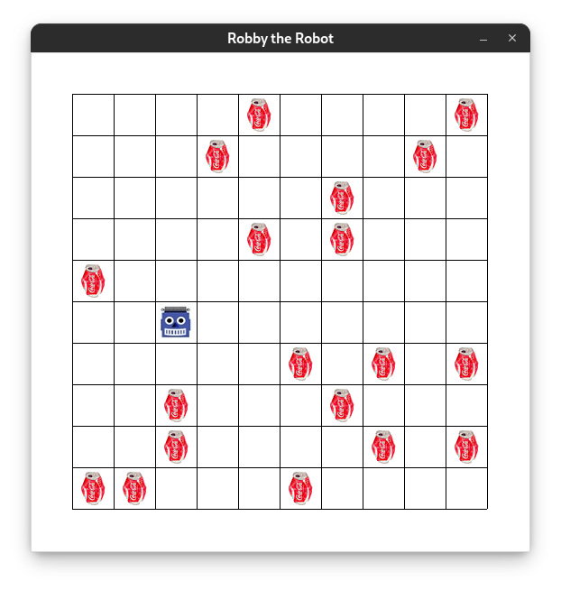

## Evolving Robby the Can-Collecting Robot
This is a toy problem about a robot designed to collect cans. It takes place on a grid (10x10 in this instance) and involves Robby, the robot, who can see the four squares to his north, south, east, and west as well as the square he currently inhabits. Based on these inputs, he can take one of seven actions: move north, south, east, or west; stay put; pick up a can; or move randomly. His goal is to pick up as many cans as possible in the number of steps alloted for the test.

The inputs are represented as a percept number from 0-242 (one for each possible state) and this number works as an index to a place in Robby's genome. This genome is what dictates Robby's actions and is what is mutated and crossed over during evolution. At each index in Robby's genome is a number from 0-6 corresponding to the action he will take for that specific percept state.

## Evolution
To create an ideal algorithm for Robby, a genetic algorithm takes a given population and tests it, then creates a new generation by combining the genomes of successful members of the first generation and mutating the crossed-over genomes. With a large enough population and given enough generations, Robby's performance will (ideally) incrementally improve.

To maximize this improvement, there are some parameters that shouuld be tweaked. These are:

- mutation rate: the probability of each number in the genome being replaced by a random number
- crossover rate: the probability of combining two genomes vs simply copying one
- crossover function: how the two parent genomes are combined. I have implemented single-point crossover (take from one parent before the randomly chosen index and from the other parent after), k-point crossover (same as single point but alternating between parents for k randomly-chosen indices), and uniform random crossover (select from either parent with 50% probability for each index in the genome)
- selection function: how the parent genomes are selected. I have implemented weighted radom/ranked choice selection, uniform random selection, and n-best selection
- fitness function: which actions are considered 'good' or 'bad' for each percept. I have implemented one that only rewards can-collection and ignores any other action (this is what I have found to give the best results) and one that both rewards can-collection and punishes hitting the wall (I found this one to struggle to learn that picking up cans is good)
    
In addition to the initial training parameters, there are some other things that must be set before training:

- population size: how many genomes are tested and mutated per generation
- generations: how many times the trainer will test and mutate a population
- steps: the number of steps Robby will be run for in each genome test
- can fill rate: the probability of each square in the world being populated with a can as opposed to remaining empty

I found that I got the best results with a low mutation rate, 100% crossover rate, a 2-point crossover function, a ranked choice selection function, and only rewarding can collection. My tests were performed with a population size of 200, run for 500 generations, with each test taking 200 steps and the world having a can fill rate of 25%. With these parameters, the simulation did not take an unreasonably long amount of time and consistently reached a point of performing better than the example hard-coded genome.

## Design
Initially, I created a simple set of functions to handle the testing, mutation, and evolution of Robby. This did what I needed it to (after the obligatory time of debugging and failed attempts), but when it proved successful, I wanted to improve it before fiddling with the training parameters. To this end, I restructured the code into an object-oriented modular system. I wanted proper separation between pieces in addition to an easy way to swap out some parts, namely the crossover, selection, and fitness functions.

Since this is a small project and I don't plan to come back to it, restructuring everything in this way was not strictly necessary, but in my opinion it makes the code more readable as well as making testing and finding ideal parameters much easier. Rather than having hardcoded values that I have to search through a monolithic set of functions to update parameters, I can simply alter the trainer constructor and training function arguments.

The crossover functions were the only of the three types to truly benefit from object-oriented design - the other two could have just as easily been functions - but since I wanted to maintain some level of consistency, I decided to make all three into classes that are then passed into the trainer. 

## Resources
[Description and Robby source code](http://modelai.gettysburg.edu/2016/robby/)

[Complexity by Melanie Mitchell](https://doi.org/10.1063/1.3326990)